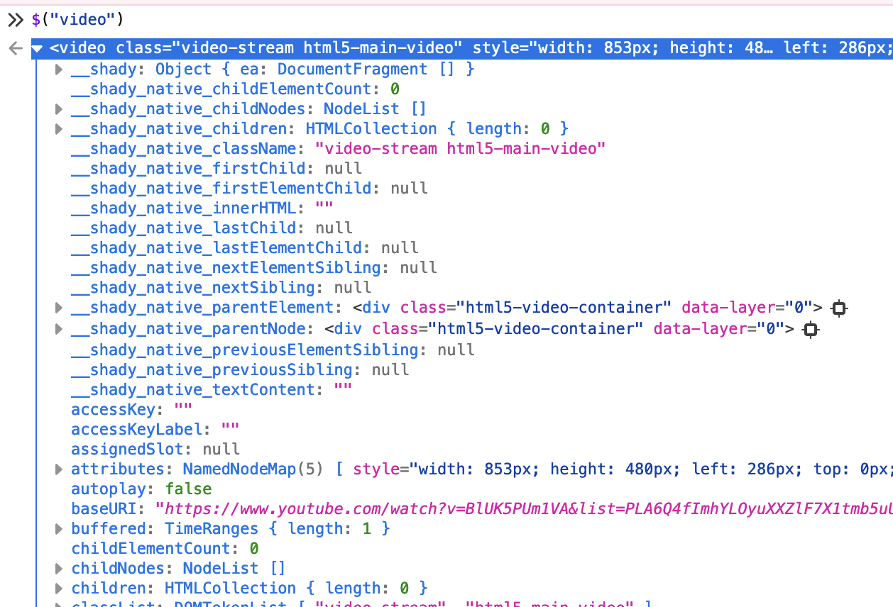
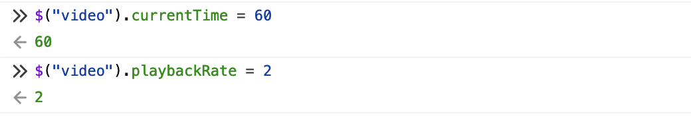

+++
title = "Fast-forwarding Videos with Javascript"
date = "2023-05-11T20:50:21+02:00"

[taxonomies]
tags = ["adhd", "browser", "javascript"]
categories = ["blog"]
+++

Maybe you're like me and you have ADHD, and are allergic to watching videos at normal speed. Maybe you're looking to fast-forward through videos for some other reason. YouTube has options for 0.25x to 2x in increments of 0.25. But sometimes you want to go faster than that, or maybe you're watching on a different site that doesn't have those controls exposed.

There are probably browser extensions that do this, but it's pretty simple to implement ourselves. As a bonus it means you don't have to trust a random browser extension, in case you're paranoid like I am!

If you don't care about how this works or how you can explore stuff like this and just want to know what code to copy/paste to get these bookmarklets, [skip to the end here](#final-result-tl-dr).

<!-- more -->

## Manipulating Videos with Javascript

Your browser exposes the content of the webpage you're viewing to javascript code so that the code can make the page do useful things. We can write our own code to take advantage of this!



If we look at the element representing a video, we can see that it has a _lot_ of attributes (they keep going well beyond what's in the screenshot). Of particular interest to us are the `playbackRate` and `currentTime` attributes. We can change these by assigning them new values:



If we leave a video running and mess around with this, we can confirm that changing `playbackRate` and `currentTime` do what we expect, great! Having to go through this whole process every time we wanted to change something would be a drag though. Fortunately we don't have to!

## Bookmarklets

We can automate this process by putting it in a [bookmarklet](https://en.wikipedia.org/wiki/Bookmarklet). We do that by putting our javascript in a bookmark where the URL would normally go, and it'll run when we click the bookmark. Maybe we could create a browser extension or something with a slightly nicer user interface, but that would also take more effort and I think this method is good enough for my purposes.

If we package our code up into a nice function like this:

```javascript
javascript:(function() {
  for (let i = 0; i < videos.length; i++) {
    videos[i].playbackRate = 2;
  }
})();
```

we can copy/paste this into several bookmark definitions and change the 2 to something else to have buttons for various speeds we might commonly want.

## Prompting the User

If you don't want a billion bookmarks clogging up your bookmark bar you could also prompt the user for their desired rate.

```javascript
javascript:(function() {
  let speed = prompt("Enter desired video speed");
  let videos = document.getElementsByTagName("video");
  for (let i = 0; i < videos.length; i++) {
    videos[i].playbackRate = speed;
  }
})();
```

This lets us only have one bookmark, but does mean we need to type in the speed we want each time. I ended up finding that dedicated bookmarks for 1x, 2x, 2.5x, 3x, 3.5x, 4x and 8x were a good range of options for me. I can reset the video to normal speed with 1x if there's a complicated part, use the 2-4x depending how fast the people in the video talk, and use 8x to fast forward when looking for a specific piece.

If you don't enter a valid number the bookmarklet will throw an error, but since we're the only people who will be using this we aren't too worried about that. If you really wanted to you could add some checks and alert the user if they entered something that wasn't valid.

## Final Result (TL;DR)

Copy the following code into a bookmark's URL field to make a button which will set the speed of all videos on a webpage to 2x. Change the number before saving to create one that sets it to a different speed. Maybe make multiple if you want e.g. one button to 2x speed, one to 3x, and one to go back to normal (1x). The world is your oyster!

```javascript
javascript:(function() {
  let videos = document.getElementsByTagName("video");
  for (let i = 0; i < videos.length; i++) {
    videos[i].playbackRate = 2;
  }
})();
```

The following works the same, but jumps forward thirty seconds (and setting a negative number makes it jump back):

```javascript
javascript:(function() {
  let videos = document.getElementsByTagName("video");
  for (let i = 0; i < videos.length; i++) {
    videos[i].currentTime += 30;
  }
})();
```

## Taking it Further

I haven't yet thought about how to do this in a mobile browser, I'm not sure if bookmarklets work there but even if they did I'm assuming they'd be pretty annoying to use. If you watch a lot of videos on your phone's browser it might actually be worth looking into writing a browser extension. Generally if I'm watching videos on my phone though it's on an app which has these features already though.
