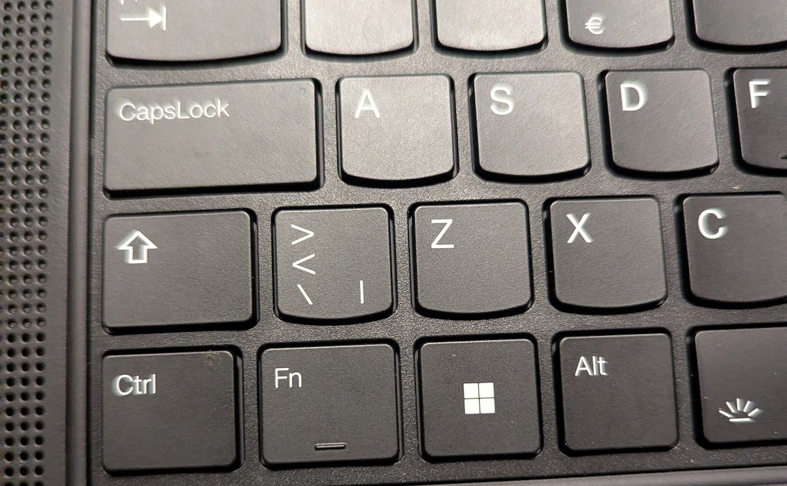

+++
title = "Small Learnings: udev and tweaking keyboard inputs on Linux"
date = "2024-12-05T20:22:45+02:00" 

[taxonomies]
tags = ["computers", "linux", "small learnings"]
categories = ["blog"]

[extra]
sidenotes = true
+++

I got a new computer at work, which has the Norwegian keyboard. This messed up my muscle memory because the position I'm used to having as the shift key is actually split into two separate keys, but luckily there are ways to fix that!

<!-- more -->

## The problem

This is what the new keyboard looks like:



In the keyboards I'm used to the left shift key extends into the space which on this keyboard has the `><\|` key, so even after switching the keyboard layout to one I was more familiar with I was still repeatedly hitting that key and inserting a `<` character instead of the shift modifier. Initially I looked into custom keyboard layouts and a tool called xmodmap, but while researching those I came across a much nicer solution: `udev`.

## udev

udev is a device manager for the linux kernel, and it lets me do exactly what I want in this scenario: turn the `><\|` key into a second shift while leaving everything else alone (the keyboard layout I use has all of those characters elsewhere on the keyboard, so I can still type them).

Keyboard input gets processed in a few steps in linux: first the physical key that gets pressed triggers a scancode, which corresponds to that physical key. udev translates that scancode to a keycode, and the keyboard layout then translates that keycode (and any modifier keys like shift) into a key symbol which is what actually gets output as text. What udev lets us do here is take the scancode for that extra key and map it to the same keycode as the shift button, so that through the rest of the process it gets treated exactly the same as if we had pressed the left shift.

Fortunately for us, our friendly Arch wiki has a [tutorial](https://wiki.archlinux.org/title/Map_scancodes_to_keycodes) on doing exactly this kind of thing.

## Finding the scancode

To get the scancode, we can use a program called `evtest`:

```plain
$ sudo evtest
No device specified, trying to scan all of /dev/input/event*
Available devices:
/dev/input/event0:  Sleep Button
/dev/input/event1:  Lid Switch
...
```

Once we select the device for the keyboard (in this case `/dev/input/event3`), evtest starts listening for events and printing them to the screen. By pressing the key we're interested in we can find out what its scancode is:

```plain
Event: time 1732611073.702170, type 4 (EV_MSC), code 4 (MSC_SCAN), value 56
Event: time 1732611073.702170, type 1 (EV_KEY), code 86 (KEY_102ND), value 1
```

From this we can see that the scancode we want to remap is 0x56.
The scancode is printed in hex even though it doesn't have the leading 0x for some reason.


## Finding the keyboard

We need one other piece of information before setting up our mapping: I don't want to mess with external keyboards that I plug in, so we need to find the identifier of the laptop's built-in keyboard to constrain our remapping to only that device. The arch wiki also tells us how to do this, and it's as simple as printing out the contents of a file!

```plain
$ cat /sys/class/input/event3/device/modalias
input:b0011v0001p0001eAB830e0,1,4,11,14,k71...
```

It carries on like that for a while, but thanks to wildcards we only really have to care about that bit at the start.

## Creating the mapping

udev is modified by hardware database files, which live (among other places) in `/usr/lib/udev/hwdb.d`. We create our new mapping as follows in a file there; I called mine `90-wide-shift.hwdb`.

```
evdev:input:b0011v0001p0001eAB83*
 KEYBOARD_KEY_56=leftshift
```

First we tell udev that we only want this to apply to the laptop keyboard. Then we tell it that we want the scancode 0x56 to map to the `leftshift` keycode. If we wanted to make other changes, we could put them there too.After doing this, for example, I also went in and made one that disabled the middle click of the mouse buttons above the trackpad because it was really easy to accidentally press and paste things.

Finally, we need to run a few commands to tell hwdb and udev that they should refresh because we've made changes:

```plain
$ sudo systemd-hwdb update
$ sudo udevadm trigger
```

And that's it! Running evtest again, we can see that both scancodes get mapped to the same keycode now:

```plain
Event: time 1733426151.996356, type 4 (EV_MSC), code 4 (MSC_SCAN), value 2a
Event: time 1733426151.996356, type 1 (EV_KEY), code 42 (KEY_LEFTSHIFT), value 1
...
Event: time 1733426154.755950, type 4 (EV_MSC), code 4 (MSC_SCAN), value 56
Event: time 1733426154.755950, type 1 (EV_KEY), code 42 (KEY_LEFTSHIFT), value 1
```
